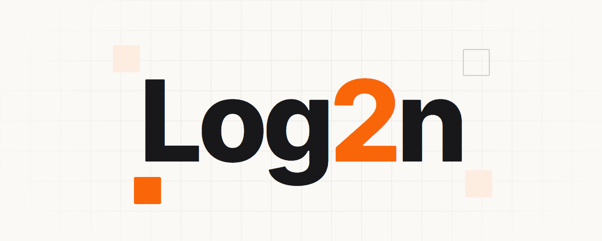

  

**Software-engineering company founded by [Loïc Baumann](https://github.com/nockawa)** — three decades building real-time 3D engines, server-side systems, and desktop applications.

## Typhon

Our flagship: a **microsecond-latency ACID data engine** with a native Entity-Component-System data model, built for real-time workloads — game servers, simulations, and stateful dataflow.

> **ACID in microseconds.** Simple, fast, safe — and it remembers everything.

- 📦 &nbsp;**[Typhon on GitHub »](https://github.com/Log2n-io/Typhon)**
- 🌐 &nbsp;Product — **[typhondb.io](https://typhondb.io)**
- 📚 &nbsp;Docs — **[doc.typhondb.io](https://doc.typhondb.io)**

## Consulting

We also advise on **high-performance systems** — architecture, concurrency, storage engines, and low-latency .NET.

→ &nbsp;**[log2n.io](https://log2n.io)** · France
